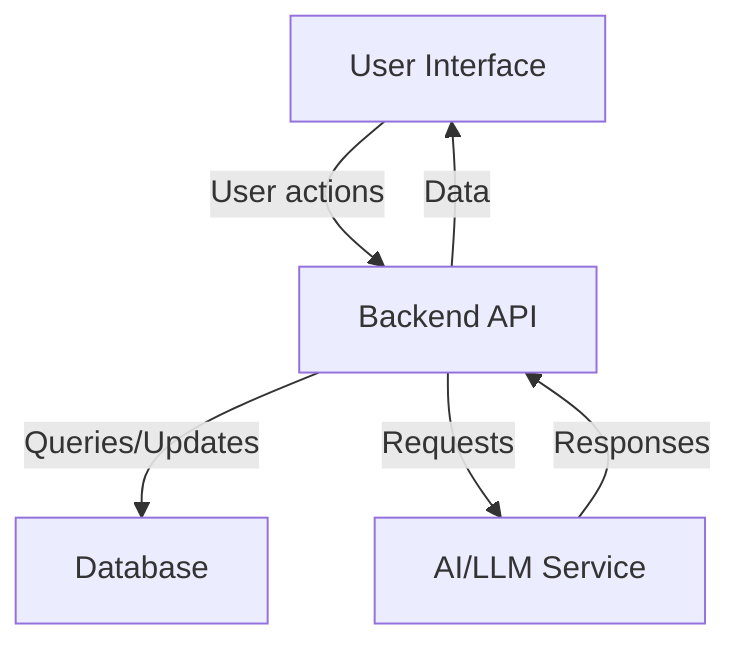

# Narrative Chat System Design

## 1. Data Model Design

- Narratives: Main and sub-narratives, with sub-narratives linked to plot points.
- Plot Points: Include title, content, sort order, event date, evidence date.
- Notes: Attach notes to plot points and sub-narratives.
- Timeline: Chronological ordering of plot points and sub-narratives.

## 2. UI/UX Flow

- Add plot points and sub-narratives with clear parent-child relationships.
- Display narratives and plot points in timeline or hierarchical view.
- Attach notes to timeline elements.
- Intuitive navigation between main narrative, plot points, and sub-narratives.

## 3. Timeline Plotting and Note Attachment

- Visual timeline component showing plot points and sub-narratives.
- Add, edit, and view notes linked to timeline items.
- Filtering and searching timeline events.

## 4. AI/LLM Interaction

- AI accesses narrative and timeline data for context.
- AI suggestions update narratives or notes.
- User and system prompts designed for narrative chat.

## 5. Technical Specification

- Data schema for narratives, plot points, notes.
- API endpoints and payloads.
- Frontend components and state management.
- AI integration points.

## 6. Architecture Diagram

## 7. Review and Approval

- Present design and diagrams for feedback.
- Adjust design based on input before implementation.

---

Please review this design document and let me know if you want any changes or additions.
