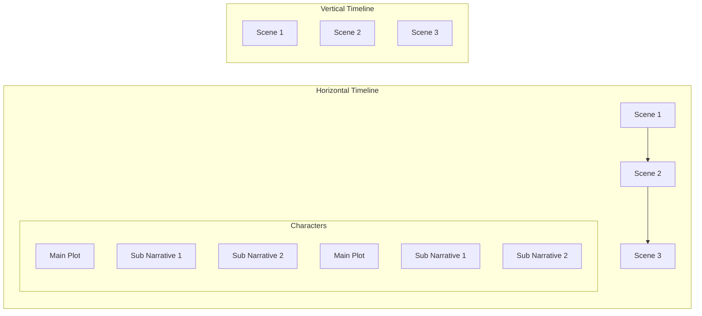

# Timeline UI Design Mockups

## Horizontal Timeline

- Events and plot points arranged left to right.
- Multiple narrative threads shown as parallel rows.
- Suitable for wide desktop screens.
- Allows quick overview of entire timeline.
- Supports drill-down on events for details.

## Vertical Timeline

- Events arranged top to bottom.
- Narrative threads stacked vertically.
- Better for narrow or scrolling interfaces.
- Easier to read long timelines.
- Supports drill-down on events for details.

## Toggle Control

- User can switch between horizontal and vertical views.
- Toggle placed in main toolbar for quick access.

## Visual Example

---

Please review these mockups and let me know if you want me to proceed with implementation or make adjustments.
